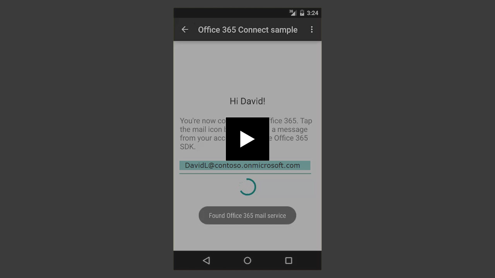

# Office 365 Connect-Beispiel für Android unter Verwendung von Microsoft Graph

Für die Arbeit mit Office 365-Diensten und -Daten muss jede Android-App zunächst eine Verbindung zu Office 365 herstellen. In diesem Beispiel wird gezeigt, wie die Verbindung zu und dann der Aufruf einer API über Microsoft Graph (wurde zuvor als vereinheitlichte Office 365-API bezeichnet) erfolgt.
> Hinweis: Rufen Sie die Seite [Erste Schritte mit Office 365-APIs](http://dev.office.com/getting-started/office365apis?platform=option-android#setup) auf. Auf dieser wird die Registrierung vereinfacht, damit Sie dieses Beispiel schneller ausführen können.

## Geräteanforderungen

Zum Ausführen des Connect-Beispiels muss das Gerät die folgenden Anforderungen erfüllen:

* Eine Bildschirmgröße von mindestens 800 x 480 Pixel.
* Android-API-Ebene 15 oder höher.
 
## Voraussetzungen

Zum Verwenden des Office 365 Connect-Beispiels für Android benötigen Sie Folgendes:

* [Android Studio](http://developer.android.com/sdk/index.html) Version 1.0 oder höher.
* [Java Development Kit (JDK) 7](http://www.oracle.com/technetwork/java/javase/downloads/jdk7-downloads-1880260.html).
* Ein Office 365-Konto. Sie können sich für [ein Office 365-Entwicklerabonnement](https://profile.microsoft.com/RegSysProfileCenter/wizardnp.aspx?wizid=14b845d0-938c-45af-b061-f798fbb4d170) registrieren. Dieses umfasst die Ressourcen, die Sie zum Erstellen von Office 365-Apps benötigen.

    > Hinweis: Wenn Sie bereits über ein Abonnement verfügen, gelangen Sie über den vorherigen Link zu einer Seite mit der Meldung *Leider können Sie Ihrem aktuellen Konto diesen Inhalt nicht hinzufügen*. Verwenden Sie in diesem Fall ein Konto aus Ihrem aktuellen Office 365-Abonnement.
* Ein Microsoft Azure-Mandant zum Registrieren Ihrer Anwendung. Von Azure Active Directory werden Identitätsdienste bereitgestellt, die durch Anwendungen für die Authentifizierung und Autorisierung verwendet werden. Hier kann ein Testabonnement erworben werden: [Microsoft Azure](https://account.windowsazure.com/SignUp).

     > Wichtig: Sie müssen zudem sicherstellen, dass Ihr Azure-Abonnement an Ihren Office 365-Mandanten gebunden ist. Rufen Sie dafür den Blogpost [Creating and Managing Multiple Windows Azure Active Directories](http://blogs.technet.com/b/ad/archive/2013/11/08/creating-and-managing-multiple-windows-azure-active-directories.aspx) des Active Directory-Teams auf. Im Abschnitt **Adding a new directory** finden Sie Informationen über die entsprechende Vorgehensweise. Weitere Informationen finden Sie zudem unter [Einrichten Ihrer Office 365-Entwicklungsumgebung](https://msdn.microsoft.com/office/office365/howto/setup-development-environment#bk_CreateAzureSubscription) im Abschnitt **Verknüpfen Ihres Office 365-Kontos mit Azure AD zum Erstellen und Verwalten von Apps**.
      
* Eine Client-ID und Umleitungs-URI-Werte einer in Azure registrierten Anwendung. Dieser Beispielanwendung muss die Berechtigung **E-Mails unter einem anderen Benutzernamen senden** für **Microsoft Graph** gewährt werden. [Fügen Sie eine native Clientanwendung in Azure hinzu](https://msdn.microsoft.com/office/office365/HowTo/add-common-consent-manually#bk_RegisterNativeApp), und [gewähren Sie ihr die entsprechenden Berechtigungen](https://github.com/OfficeDev/O365-Android-Microsoft-Graph-Connect/wiki/Grant-permissions-to-the-Connect-application-in-Azure).

## Öffnen des Beispiels mithilfe von Android Studio

1. Installieren Sie [Android Studio](http://developer.android.com/sdk/index.html), und fügen Sie gemäß den [Anleitungen](http://developer.android.com/sdk/installing/adding-packages.html) auf „developer.android.com“ die Android SDK-Pakete hinzu.
2. Laden Sie dieses Beispiel herunter, oder klonen Sie es.
3. Starten Sie Android-Studio.
	1. Schließen Sie alle möglicherweise geöffneten Projekte, und wählen Sie dann **Vorhandenes Android Studio-Projekt öffnen** aus.
	2. Navigieren Sie zum lokalen Repository, und wählen Sie das Projekt „O365-Android-Microsoft-Graph-Connect“ aus. Klicken Sie auf **OK**.
	
	> Hinweis: In Android Studio wird möglicherweise ein Dialogfeld angezeigt, in dem Sie gefragt werden, ob Sie den Gradle-Wrapper verwenden möchten. Klicken Sie auf **OK**.
	> 
	> **Frameworks erkannt****Android-Support-Repository**
4. Öffnen Sie die Datei „Constants.java“.
	1. Suchen Sie nach der Konstante „CLIENT_ID“, und legen Sie ihren Wert „String“ entsprechend der Client-ID fest, die Sie in Azure Active Directory registriert haben.
	2. Suchen Sie nach der Konstante „REDIRECT_URI“, und legen Sie ihren Wert „String“ entsprechend dem Umleitungs-URI fest, den Sie in Azure Active Directory registriert haben. 
 

    > Hinweis: Wenn Sie weder über „CLIENT_ID“- noch über „REDIRECT_URI“-Werte verfügen, [müssen Sie eine native Clientanwendung in Azure hinzufügen](https://msdn.microsoft.com/de-de/library/azure/dn132599.aspx#BKMK_Adding) und die Werte „CLIENT_ID“ und „REDIRECT_URI“ beachten.

Nach dem Einrichten des Connect-Beispiels können Sie es auf einem Emulator oder Gerät ausführen. Wählen Sie ein Gerät mit API-Ebene 15 oder höher aus dem Dialogfeld **Gerät auswählen** aus.

Weitere Informationen über das Beispiel finden Sie unter [Aufrufen von Microsoft Graph in einer Android-App](https://graph.microsoft.io/de-de/docs/platform/android).

## Fragen und Kommentare

Wir schätzen Ihr Feedback hinsichtlich des Office 365 Android Connect-Projekts. Sie können uns Ihre Fragen und Vorschläge über den Abschnitt [Probleme](https://github.com/OfficeDev/O365-Android-Microsoft-Graph-Connect/issues) dieses Repositorys senden.

Allgemeine Fragen über die Office 365-Entwicklung sollten in [Stack Overflow](http://stackoverflow.com/questions/tagged/Office365+API) gepostet werden. Stellen Sie sicher, dass Ihre Fragen oder Kommentare mit [Office365] und [API] markiert sind.

## Nächste Schritte

In diesem Beispiel werden die Grundlagen für das Funktionieren Ihrer Apps mit Office 365 gezeigt. Mithilfe von Office 365-APIs können Ihre Apps viele weitere Aktionen vornehmen wie das Unterstützen Ihrer Benutzer bei der Verwaltung ihrer täglichen Arbeit mit dem Kalender, das Auffinden der benötigten Informationen in allen in OneDrive gespeicherten Dateien oder das Auffinden der gewünschten Person in ihrer Liste der Kontakte. Weitere interessante Informationen finden Sie unter [Office 365 APIs-Startprojekt für Android](https://github.com/officedev/O365-Android-Start/). Diese werden unserer Ansicht nach Ihre Ideen bereichern.
  
## Zusätzliche Ressourcen

* [Office 365 APIs-Plattformübersicht](https://msdn.microsoft.com/office/office365/howto/platform-development-overview)
* [Erste Schritte mit Office 365-APIs](http://dev.office.com/getting-started/office365apis)
* [Übersicht zu Office 365 Microsoft Graph](http://graph.microsoft.io)
* [Office 365 SDK für Android](https://github.com/OfficeDev/Office-365-SDK-for-Android)
* [Office 365 APIs-Startprojekt und -Codebeispiele](https://msdn.microsoft.com/office/office365/howto/starter-projects-and-code-samples)
* [Office 365 Android Microsoft Graph-Ausschnitte](https://github.com/OfficeDev/O365-Android-Microsoft-Graph-Snippets)
* [Office 365 APIs-Startprojekt für Android](https://github.com/OfficeDev/O365-Android-Start)
* [Office 365 Profile-Beispiel für Android](https://github.com/OfficeDev/O365-Android-Profile)

## Copyright
Copyright (c) 2015 Microsoft. Alle Rechte vorbehalten.
